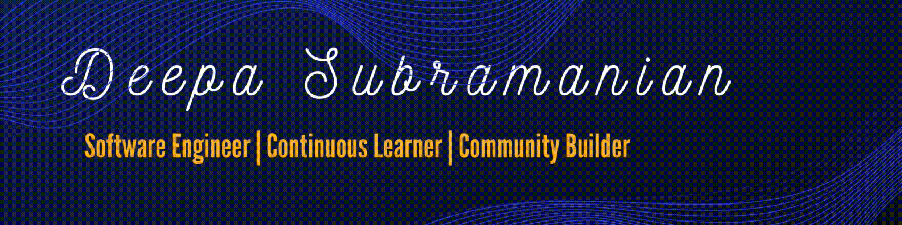

### Hi there! 👋 
### Welcome to my GitHub

---- 
#### 👩🏽‍💻 About Me

I am passionate about coding, teaching, learning and giving back to the community. Previously, I have worked at Adobe, Google, Apple, Microsoft etc. 

---- 
#### Favorite tech 

#### I want to learn more

----

#### I love to share my knowledge

I love to share my knowledge to the community and here are the events I have spoken at meetsup and conferences (in-person and virtual).

<h3>Upcoming speaking engagements</h3>

#### 2024
1. January Online - [Fluttering into the Future: A Beginner's Guide to App Development](https://gdg.community.dev/events/details/google-gdg-broward-county-fl-presents-fluttering-into-the-future-a-beginners-guide-to-app-development/)
2. Feburary in person - [Building Tomorrow: Exploring Flutter and PWA](https://www.tracydevs.com/2024/02/building-tomorrow-exploring-flutter-pwa/)
3. April - Google Cloud Next - Panel Speaker
5. May - iJS San Diego [Building Intelligent UIs with React and AI](https://javascript-conference.com/react/intelligent-ui-react-ai/)
6. May - iJS San Diego [Don't Bug Out! Automate Testing with Puppeteer and Cypress](https://javascript-conference.com/javascript-practices-tools/automate-testing-with-puppeteer-cypress/)
7. May - iJS San Diego [Building Scalable UIs with Component Driven Microfrontends](https://javascript-conference.com/react/scalable-uis-component-driven-microfrontends/)
8. May - Geekle React Summit](https://events.geekle.us/react24/)
9. May - [SheWorks Menstural Health Summit](https://www.eventbrite.com/e/sheworks-period-check-menstrual-health-summit-tickets-860091004347?aff=ebdsoporgprofile)
10. September - [JavaScript Summit](https://geekle.us/schedule/javascript24)
11. October - [GDG Aquaba](https://gdg.community.dev/events/details/google-gdg-aqaba-presents-unlocking-angular-and-ai-a-match-made-in-code-devfest/)
12. October - iJS New York
13. October - GDG Silicon Valley - Panel Speaker
14. November 14th - As a Mentor at AnitaB.org Speed mentoring event at Santa Clara
15. November 16th - https://gdg.community.dev/events/details/google-gdg-hudson-presents-devfest-2024-troy-ny/
16. November 16th - https://gdg.community.dev/events/details/google-gdg-hudson-presents-devfest-2024-troy-ny/
17. November 25th - [QA Global Summit](https://events.geekle.us/qa/)

#### 2023
1. November 7th - React Global Summit ["Build React app with Qwik!"](https://events.geekle.us/react24/)
2. October 27th - Online-Vilharmosa - [Building PWA using Flutter web](https://gdg.community.dev/events/details/google-gdg-villahermosa-presents-devfest-2023-tabasco/cohost-gdg-villahermosa)
3. October 28th - GDG Modesto - in person 
4. October 15th - @DevFest Orlando - [Let's build an app quickly with QWIK!](https://orlando.devfestflorida.com/speakers)
5. October 15th - @Devfest Orlando - [Build and Deploy React progressive web app to Firebase](https://orlando.devfestflorida.com/speakers)
6. September - iJS - Is Next.js is the new React.js?
7. September - JS Summit - PWA performance optimization
8. June - How to cook Project Fugu Api's ?
9. June - [Bring your React apps to life with Animations](https://www.linkedin.com/feed/update/urn:li:activity:7076929717806800896?utm_source=share&utm_medium=member_desktop) with Pesto tech
10. June -  Flutter PWA - Meetup at hacker dojo Sunnyvale.
11. May - [Build an app with three in one - Flutter, PWA and Firebase](https://gdg.community.dev/events/details/google-gdg-waterloo-presents-build-and-deploy-flutter-pwa-to-firebase/)
12. May - [Flutter Forward extended](https://gdg.community.dev/events/details/google-gdg-san-jose-presents-flutter-forward-extended-hybrid-event/)
13. April - [Women in Firebase - Build a PWA in Flutter Web and, Deploy in Firebase!](https://www.meetup.com/women-in-firebase/events/291971605/?utm_medium=referral&utm_campaign=share-btn_savedevents_share_modal&utm_source=link)
14. April - React Chicago - [Building beautiful UI using Storybook.js](https://www.meetup.com/react-chicago/events/290500610/)
15. April 2023 - [Build and Deploy: React Progressive web app to Firebase](https://events.geekle.us/react23/) React Global Summit 
16. Feb 2023 - Angular Summit - [Power up your Angular app with PWA'S](https://www.youtube.com/watch?v=9LR6AsdpMOQ&t=479s)
17. Jan 2023 - Node.js Summit - [The power of two technologies - Node.js and PWA!](https://www.youtube.com/watch?v=kNU-nOKrjG8&t=253s)
18. Jan 2023 - GDSC McMasters Univeristy - My journey to tech

#### 2022
1. Dec 2022 - Angular Nation - Wanna learn Angular? 
2. November 2022 - React Global Summit. Event link: https://events.geekle.us/react3/
3. October 2022 - [Fundamental JS](https://www.meetup.com/sandiegojs/events/286559765/)-Overview of PWA
4. October 2022 - WWCode - Getting Started with PWA. Event link: https://us02web.zoom.us/webinar/register/WN_rA2LKmwLRaCg5gJGU49XKg
5. Sep 2022 - JavaScript Global Summit - https://www.youtube.com/watch?v=UzCgGvtoJfo&feature=youtu.be
6. Sep 2022 - International JavaScript New York Conference - https://javascript-conference.com/speaker/deepa-subramanian/
7. June 2022 - [Google Developer Student Club](https://gdsc.community.dev/events/details/developer-student-clubs-conestoga-college-waterloo-campus-presents-dos-and-donts-of-graphql-and-rest-api-services/) 
   - Dos and Don’ts of GraphQL and REST API Services - https://www.youtube.com/watch?v=dyGl1HbRV2E
8. May 2022 - [Node.JS Geekle Global Summit](https://events.geekle.us/nodejs/) 
   - How to build a Fast & Scalable Website Using Node.js - https://www.youtube.com/watch?v=RYpivX9P8-I
9. May 2022 - [Google Developer Communities North America - International Women's Day GDG](https://rsvp.withgoogle.com/events/iwd-northamerica)
   - Pulling the strings of Puppeteer for web automation - https://www.youtube.com/watch?v=oRx6SebCmd4
10. April 2022 - [Google Developer Student Club](https://gdsc.community.dev/events/details/developer-student-clubs-conestoga-college-waterloo-campus-presents-how-to-get-started-with-angular-and-firebase-online-event/)
    - How to get started with Angular and Firebase - https://www.youtube.com/watch?v=pP_ldsQe7oQ
11. March 2022 - [Google Developer Student Club](https://gdsc.community.dev/events/details/developer-student-clubs-conestoga-college-waterloo-campus-presents-js-data-structures-online-event/)
    - Data Structures in JS -  https://youtu.be/dAKay0VwFmc 
12. March 2022 - [React Houston](https://www.meetup.com/Houston-React-Js-Group/events/283828748/)
    - Redux, MobX and What's Next in Managing State - https://www.youtube.com/watch?v=iOa5ff_ga3o
13. Jan 2022 - [React Chicago](https://www.meetup.com/React-Chicago/events/282659282/)
    - React Components, States and Hooks - https://www.youtube.com/watch?v=0S9nZ7moLnU
14. Jan 2022 - [Fundamental JS](https://www.meetup.com/sandiegojs/events/283090494)
    - Creational design pattern in JavaScript 
15. Google NAConnect - Shared about my first in person conference experience.(https://www.linkedin.com/feed/update/urn:li:activity:6994864533383106560/)

#### 2021

1. Dec 2021 - [Fundamental JS](https://www.meetup.com/sandiegojs/events/whwkqsyccqbdc/) 
   - Getting started with more JavaScript with essential ES6 features 
2. [Fundamental JS](https://www.meetup.com/sandiegojs/events/whwkqsyccnbkc/)
    - Getting started with JavaScript
3. Dec 2021 - Woman Who Code Frontend 
    - Introduction to React - https://www.youtube.com/watch?v=CHxbN4tGPT4
4. August 10, 2021 - [Angular KC](https://www.meetup.com/angularkc/events/279845252/)
    - Getting started with Angular and Firebase - https://www.youtube.com/watch?v=P-BnODS016M   
----

#### Let's keep in touch!

